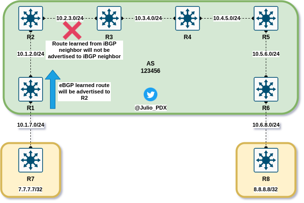

# BGP Challenge Lab

## Background

Hello and thank you for giving this lab a try. I was recently working my way through CCIE Routing and Switching v5.0 by Narbik Kocharians(great book) and the BGP chapters sparked my interest in creating this challenge lab. Please note, this lab should be viewed as a skills challenge to test ones knowledge of BGP, it is not an accurate representation of proper network design. I was curious how something could be solved when restrictions are added or links are limited in a BGP scenario. 

## The Topology


The lab consists of 8 Arista nodes all running version 4.27.0F. Alternate versions should also work. Arista images can be obtained for free on their support site. R1 through R6 are in ASN 123456. R7 and R8 are in ASN 7 and 8 respectively.

## Objective

R1 is peered with R7 in AS 7. R7 should advertise its loopback0(`7.7.7.7/32`) interface into BGP. R6 is peered with R8 in AS 8. R8 should advertise its loopback0(`8.8.8.8/32`) interface into BGP. BGP router IDs should be manually set to `x.x.x.x`, where x is the node number. For example, R7 router ID would be `7.7.7.7`.All interface addresses have been configured for you. The lab is complete when R7 and R8 can reach the remote networks from their loopback0 interfaces.

## Deploying Topology

Make sure the following items are installed on your host machine:

- [Docker](https://www.digitalocean.com/community/tutorials/how-to-install-and-use-docker-on-ubuntu-20-04)
- [Containerlab](https://containerlab.srlinux.dev/install/)
- [Arista container image, example from blog](https://juliopdx.com/2021/12/10/my-journey-and-experience-with-containerlab/)

```shell
git clone https://github.com/JulioPDX/learning_labs.git
cd learning_labs/labs/bgp/arista/
sudo containerlab deploy -t bgp.clab.yaml

```

## Restrictions

- No static routes
- No IGPs(OSPF, IS-IS, RIP)
- No additional links can be added

## Solutions

Once solved, feel free to check out the solutions below. If they are different than the ones listed, please share them with me. I would love to check out your solution and learn. If you are having trouble solving the problem. Feel free to destroy the initial topology and deploy either solution 1 or 2. Make sure to destroy a topology before deploying another. Not a Containerlab restriction, I just used the same management IP space in all the labs.

Steps to deploy a solution topology:

```shell
# Destroy initial topology
sudo containerlab destroy -t bgp.clab.yaml
# Deploy new topology
sudo containerlab deploy -t solution1.clab.yaml
# or
sudo containerlab deploy -t solution2.clab.yaml
```

### Solution 1

<details close>
<summary>Solution</summary>

I'll walk through the solution in one direction, the `7.7.7.7` network reaching R8. The steps are very similar in reverse direction to get the `8.8.8.8` network to R7. For started we will configure the BGP peering between R1 and R7

```text
--- R7 ---
router bgp 7
   router-id 7.7.7.7
   neighbor 10.1.7.1 remote-as 123456
   network 7.7.7.7/32
--- R1 ---
router bgp 123456
   router-id 1.1.1.1
   neighbor 10.1.7.7 remote-as 7
```

We can check the peer and verify that network `7.7.7.7` is in the BGP table.

```text
R1#show ip bgp summary
BGP summary information for VRF default
Router identifier 1.1.1.1, local AS number 123456
Neighbor Status Codes: m - Under maintenance
  Neighbor         V AS           MsgRcvd   MsgSent  InQ OutQ  Up/Down State   PfxRcd PfxAcc
  10.1.7.7         4 7                  7         6    0    0 00:02:09 Estab   1      1
R1#show ip bgp | b Network
          Network                Next Hop              Metric  AIGP       LocPref Weight  Path
 * >      7.7.7.7/32             10.1.7.7              0       -          100     0       7 i
R1#
```

So far so good, lets add the iBGP peer between R1 and R2.

```text
--- R1 ---
router bgp 123456
   neighbor 10.1.2.2 remote 123456
--- R2 ---
router bgp 123456
   router-id 2.2.2.2
   neighbor 10.1.2.1 remote-as 123456
```

We can validate peer and check the network once again.

```
R2# show ip bgp summary
BGP summary information for VRF default
Router identifier 2.2.2.2, local AS number 123456
Neighbor Status Codes: m - Under maintenance
  Neighbor         V AS           MsgRcvd   MsgSent  InQ OutQ  Up/Down State   PfxRcd PfxAcc
  10.1.2.1         4 123456             8         7    0    0 00:02:31 Estab   1      1
R2#show ip bgp
BGP routing table information for VRF default
Router identifier 2.2.2.2, local AS number 123456
Route status codes: s - suppressed, * - valid, > - active, E - ECMP head, e - ECMP
                    S - Stale, c - Contributing to ECMP, b - backup, L - labeled-unicast
                    % - Pending BGP convergence
Origin codes: i - IGP, e - EGP, ? - incomplete
RPKI Origin Validation codes: V - valid, I - invalid, U - unknown
AS Path Attributes: Or-ID - Originator ID, C-LST - Cluster List, LL Nexthop - Link Local Nexthop

          Network                Next Hop              Metric  AIGP       LocPref Weight  Path
          7.7.7.7/32             10.1.7.7              0       -          100     0       7 i
R2#
```

We can see the peering is up but the route is not set as a valid route. Check out that next hop of `10.1.7.7`, since we cannot run an IGP or static routes in this scenario, R2 has no reachability to this network. By default, iBGP peers do not update the next hop address when sending network information. We can override this default with the `next-hop-self` command.

```text
--- R1 ---
router bgp 123456
   neighbor 10.1.2.2 next-hop-self
--- R2 ---
R2#show ip bgp | b Network
          Network                Next Hop              Metric  AIGP       LocPref Weight  Path
 * >      7.7.7.7/32             10.1.2.1              0       -          100     0       7 i
R2#
```

Now that R2 has the network information for `7.7.7.7`, we can continue down the path and add the iBGP peering from R2 to R3.

```text
--- R2 ---
router bgp 123456
   neighbor 10.2.3.3 remote-as 123456
--- R3 ---
router bgp 123456
   router-id 3.3.3.3
   neighbor 10.2.3.2 remote-as 123456
```

Checking neighbors and routes again.

```text
R3#show ip bgp summary 
BGP summary information for VRF default
Router identifier 3.3.3.3, local AS number 123456
Neighbor Status Codes: m - Under maintenance
  Neighbor         V AS           MsgRcvd   MsgSent  InQ OutQ  Up/Down State   PfxRcd PfxAcc
  10.2.3.2         4 123456             6         6    0    0 00:02:03 Estab   0      0
R3#show ip bgp | b Network
          Network                Next Hop              Metric  AIGP       LocPref Weight  Path
R3#
```

Interesting, in this case the network isn't even seen at R3. We can check to see if R2 is actually advertising the network.

```text
R2#show ip bgp neighbors 10.2.3.3 advertised-routes 
BGP routing table information for VRF default
Router identifier 2.2.2.2, local AS number 123456
Route status codes: s - suppressed, * - valid, > - active, E - ECMP head, e - ECMP
                    S - Stale, c - Contributing to ECMP, b - backup, L - labeled-unicast, q - Queued for advertisement
                    % - Pending BGP convergence
Origin codes: i - IGP, e - EGP, ? - incomplete
RPKI Origin Validation codes: V - valid, I - invalid, U - unknown
AS Path Attributes: Or-ID - Originator ID, C-LST - Cluster List, LL Nexthop - Link Local Nexthop

          Network                Next Hop              Metric  AIGP       LocPref Weight  Path
R2#
```

It looks like R2 is not sending that network information to R3. This is due to the iBGP split-horizon rule. This rule states, if a route is learned from an iBGP neighbor(R1 to R2), this network information will not be sent to another iBGP neighbor(R3).



Luckily there is a way to get around this rule. We will be implementing route reflectors(RR). RR essentially readvertise routes to other BGP peers. The only time network information will not be reflected is when a route is received from a non-client, this route will not be reflected to other non-clients. For this example we will make R2 a RR. R3 will be a client of R2. For reachability sake, we will also implement `next-hop-self` on R2 as well towards R3.


```text
--- R2 ---
router bgp 123456
   neighbor 10.2.3.3 route-reflector-client
   neighbor 10.2.3.3 next-hop-self
```

We can check to see if R3 now has reachability to this network.

```text
R3#show ip bgp 
BGP routing table information for VRF default
Router identifier 3.3.3.3, local AS number 123456
Route status codes: s - suppressed, * - valid, > - active, E - ECMP head, e - ECMP
                    S - Stale, c - Contributing to ECMP, b - backup, L - labeled-unicast
                    % - Pending BGP convergence
Origin codes: i - IGP, e - EGP, ? - incomplete
RPKI Origin Validation codes: V - valid, I - invalid, U - unknown
AS Path Attributes: Or-ID - Originator ID, C-LST - Cluster List, LL Nexthop - Link Local Nexthop

          Network                Next Hop              Metric  AIGP       LocPref Weight  Path
 * >      7.7.7.7/32             10.2.3.2              0       -          100     0       7 i Or-ID: 1.1.1.1 C-LST: 2.2.2.2 
R3#
```

you may notice a few differences in this output, the `Or-ID`(Originator ID) and `C-List`(Cluster List). Route reflectors add this information to reflected routes to assist with loop prevention. The Originator ID is set to the router that originated the advertisement of the route information(R1). If a router receives network information for a route with the same Originator ID, this information is discarded. The Cluster List value is set to the RR(R2). If another RR or this RR in the same cluster were to receive network information with this Cluster ID, it would be discarded as well.

Lets move on now to the connection from R3 to R4.

```text
--- R3 ---
router bgp 123456
   neighbor 10.3.4.4 remote-as 123456
--- R4 ---
router bgp 123456
   router-id 4.4.4.4
   neighbor 10.3.4.3 remote-as 123456
```

We can check the peering and network information on R4.

```text
R4#show ip bg sum
BGP summary information for VRF default
Router identifier 4.4.4.4, local AS number 123456
Neighbor Status Codes: m - Under maintenance
  Neighbor         V AS           MsgRcvd   MsgSent  InQ OutQ  Up/Down State   PfxRcd PfxAcc
  10.3.4.3         4 123456             9         9    0    0 00:02:56 Estab   0      0
R4#show ip bgp
BGP routing table information for VRF default
Router identifier 4.4.4.4, local AS number 123456
Route status codes: s - suppressed, * - valid, > - active, E - ECMP head, e - ECMP
                    S - Stale, c - Contributing to ECMP, b - backup, L - labeled-unicast
                    % - Pending BGP convergence
Origin codes: i - IGP, e - EGP, ? - incomplete
RPKI Origin Validation codes: V - valid, I - invalid, U - unknown
AS Path Attributes: Or-ID - Originator ID, C-LST - Cluster List, LL Nexthop - Link Local Nexthop

          Network                Next Hop              Metric  AIGP       LocPref Weight  Path
R4#
```

Very similar as before. Since R3 now learns a route from an iBGP neighbor, that node will not advertise it to other iBGP neighbors(R4). At this point the solution should be pretty clear and we need to chain route reflectors and next hop self path updates to allow for reachability. We can finish the rest of the config in one direction to make sure R8 gets the route to `7.7.7.7/32`.

```
--- R3 ---
router bgp 123456
   router-id 3.3.3.3
   neighbor 10.3.4.4 next-hop-self
   neighbor 10.3.4.4 route-reflector-client
--- R4 ---
# Check out the addition of the Cluster List!
R4#show ip bgp | b Network
          Network                Next Hop              Metric  AIGP       LocPref Weight  Path
          7.7.7.7/32             10.2.3.2              0       -          100     0       7 i Or-ID: 1.1.1.1 C-LST: 3.3.3.3 2.2.2.2 
R4#
router bgp 123456
   neighbor 10.3.4.3 next-hop-self
   neighbor 10.3.4.3 route-reflector-client
   neighbor 10.4.5.5 remote-as 123456
   neighbor 10.4.5.5 next-hop-self
--- R5 ---
router bgp 123456
   router-id 5.5.5.5
   neighbor 10.4.5.4 remote-as 123456
   neighbor 10.5.6.6 remote-as 123456
   neighbor 10.5.6.6 next-hop-self
   neighbor 10.5.6.6 route-reflector-client
# Another addition to the Cluster List!
R5#show ip bgp | b Network
          Network                Next Hop              Metric  AIGP       LocPref Weight  Path
 * >      7.7.7.7/32             10.4.5.4              0       -          100     0       7 i Or-ID: 1.1.1.1 C-LST: 4.4.4.4 3.3.3.3 2.2.2.2 
--- R6 ---
router bgp 123456
   router-id 6.6.6.6
   neighbor 10.5.6.5 remote-as 123456
   neighbor 10.6.8.8 remote-as 8
R6#show ip bgp | b Network
          Network                Next Hop              Metric  AIGP       LocPref Weight  Path
 * >      7.7.7.7/32             10.5.6.5              0       -          100     0       7 i Or-ID: 1.1.1.1 C-LST: 5.5.5.5 4.4.4.4 3.3.3.3 2.2.2.2 
--- R8 ---
router bgp 8
   router-id 8.8.8.8
   neighbor 10.6.8.6 remote-as 123456
   network 8.8.8.8/32
R8#show ip bgp | b Network
          Network                Next Hop              Metric  AIGP       LocPref Weight  Path
 * >      7.7.7.7/32             10.6.8.6              0       -          100     0       123456 7 i
 * >      8.8.8.8/32             -                     -       -          -       0       i
R8#
```

Please note, once the route reaches R8 an eBGP peer, the Cluster List and Originator ID are now gone. In this case we have solved the solution in one direction, try and solve it in the other in the other direction. If not, feel free to deploy Solution 1 and review the networks and configurations.To deploy that solution, run the command below.

```shell
sudo containerlab deploy -t solution1.clab.yaml
```

High level diagram of the RR craziness that is going on in this topology.


</details>

### Solution 2

<details open>
<summary>Solution</summary>

Solution 3

</details>

### confederations

- AS_CONFED_SEQ
- AS_CONFED_SET

next hop is not changes between confederations eBGP neighbors, show example


show solution1 in one way, the configuration in the reverse directions is essentially the same

Same with solution2
