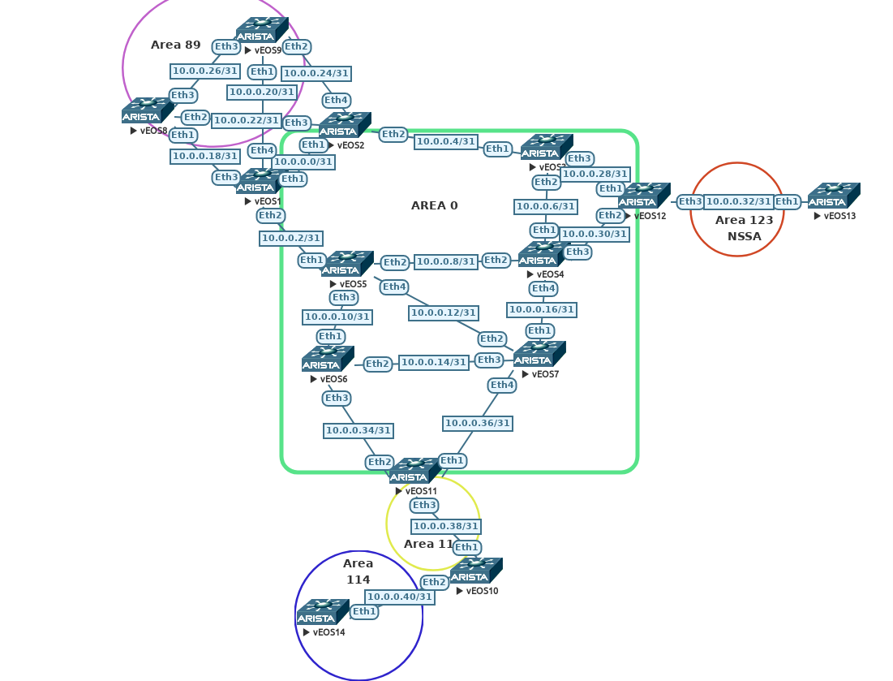

# Arista OSPF Troubleshooting Lab

Hello and thank you for giving this lab a go.



## Requirements

- [Docker](https://www.digitalocean.com/community/tutorials/how-to-install-and-use-docker-on-ubuntu-20-04)
- [Containerlab](https://containerlab.srlinux.dev/install/)
- Server or machine with a decent amount of ram and CPU. In my lab I stood up a server with 8vcpu (limit on free ESXi) and 32G of ram. Although, 16 should work just fine.
- Arista cEOS image [(sign up required)](https://www.arista.com/en/login). I am using 4.27.0F, but any other image should work. I'll explain a small difference later on in the readme.

## Purpose

A while ago I mentioned that Containerlab would be an incerdible resource in an educational or learning environment. I wanted to take a shot at how that may look like. Imagine sharing a troubleshooting topology with a fellow engineer or someone getting into networking. They could then troubleshoot and work through the lab, learning a long the way. Since this is all packaged in Docker, sharing the build is fairly simple. We could then do something like automated testing to check a student or another engineers work. Good luck on the lab and I hope you learn something along the way!

## The Lab

This lab consists of 14 cEOS nodes running OSPFv2. Every link connecting the nodes is configured as a point to point (`/31`). The lab is complete when all problems are solved and the `13.13.13.0` network is present/reachable in the routing table(no statics) for the following nodes: R8/R9/R14

Every router is configured with a router ID of `0.0.0.X`, where X is the router number. On each point to point link, the lower router receives the first IP address in the `/31` network. Every router is advertising a loopback interface of `X.X.X.X/24`, where X is the router number. There is an `interfaces.md` file in this directory, it will list all IP addresses and area assignments.

## Restrictions

If at all possible avoid using "show running-config". Try and solve the problems by using alternate troubleshooting methods and specific commands. I would advise you to push yourself a bit to find an answer before hitting the solution drop down. If you think you know the problem, feel free to use a specific command to view that portion. Example below:

```bash
R8#show run interfaces loopback0
interface Loopback0
   ip address 8.8.8.8/24
```

## Getting Started

```bash
git clone https://github.com/JulioPDX/learning_labs.git
cd learning_labs/labs/ospf_tshoot/arista
sudo containerlab deploy -t broken.clab.yaml
```

## Connecting to Nodes

```bash
# docker exec -it <node> Cli
# ssh admin@<container name>
```


## Problems

### Issue 1

It seems that R1 and R2 are not establishing a neighbor relationship, see if you can find out what is going on?

<details close>
<summary>Solution</summary>

Checking the neighbor state!

```bash
R1#show ip ospf neighbor
Neighbor ID     Instance VRF      Pri State                  Dead Time   Address         Interface
0.0.0.5         1        default  0   FULL                   00:00:31    10.0.0.3        Ethernet2
0.0.0.2         1        default  0   EXCH START             00:00:38    10.0.0.1        Ethernet1
0.0.0.8         1        default  0   FULL                   00:00:32    10.0.0.19       Ethernet3
0.0.0.9         1        default  0   FULL                   00:00:38    10.0.0.21       Ethernet4
```

Interesting, it looks like the neighbors are stuck in Exstart/Exchange. The most common issue for neighbors to be stuck in this state is an MTU mismatch. We can check the interface on R2(the default is 1500).

```bash
R2#show ip interface ethernet 1
Ethernet1 is up, line protocol is up (connected)
  Internet address is 10.0.0.1/31
  Broadcast address is 255.255.255.255
  IPv6 Interface Forwarding : None
  Proxy-ARP is disabled
  Local Proxy-ARP is disabled
  Gratuitous ARP is ignored
  IP MTU 1500 bytes
```

That looks fine, lets check out R1!

```bash
R1#show ip interface ethernet 1
Ethernet1 is up, line protocol is up (connected)
  Internet address is 10.0.0.0/31
  Broadcast address is 255.255.255.255
  IPv6 Interface Forwarding : None
  Proxy-ARP is disabled
  Local Proxy-ARP is disabled
  Gratuitous ARP is ignored
  IP MTU 1400 bytes
```

Hmm thats not good, this looks like an MTU mismatch! We can correct this by changing the R1 ethernet 1 interface to have an MTU of 1500.

```bash
R1#configure
R1(config)#interface ethernet 1
R1(config-if-Et1)#mtu 1500
R1(config-if-Et1)#show ip ospf neighbor
Neighbor ID     Instance VRF      Pri State                  Dead Time   Address         Interface
0.0.0.5         1        default  0   FULL                   00:00:36    10.0.0.3        Ethernet2
0.0.0.2         1        default  0   FULL                   00:00:38    10.0.0.1        Ethernet1
0.0.0.8         1        default  0   FULL                   00:00:38    10.0.0.19       Ethernet3
0.0.0.9         1        default  0   FULL                   00:00:34    10.0.0.21       Ethernet4
```

</details>

---

### Issue 2

R4 should have two equal cost paths to networks `8.8.8.0` and `9.9.9.0`.

<details close>
<summary>Solution</summary>

Checking the routing table is a great first step to make sure the issue is still present.

```bash
R4# show ip route ospf

 O        1.1.1.0/24 [110/40] via 10.0.0.6, Ethernet1
 O        2.2.2.0/24 [110/30] via 10.0.0.6, Ethernet1
 O        3.3.3.0/24 [110/20] via 10.0.0.6, Ethernet1
 O        5.5.5.0/24 [110/40] via 10.0.0.17, Ethernet4
 O        6.6.6.0/24 [110/30] via 10.0.0.17, Ethernet4
 O        7.7.7.0/24 [110/20] via 10.0.0.17, Ethernet4
 O IA     8.8.8.0/24 [110/40] via 10.0.0.6, Ethernet1
 O IA     9.9.9.0/24 [110/40] via 10.0.0.6, Ethernet1
 O        10.0.0.0/31 [110/30] via 10.0.0.6, Ethernet1
```

It seems we have one path via `10.0.0.6`. We can check to make sure our neighbors are up. R4 should be neighbors with R3, R5, R7, and R12.

```bash
R4#  show ip ospf neighbor
Neighbor ID     Instance VRF      Pri State                  Dead Time   Address         Interface
0.0.0.12        1        default  0   FULL                   00:00:36    10.0.0.31       Ethernet3
0.0.0.5         1        default  0   FULL                   00:00:33    10.0.0.9        Ethernet2
0.0.0.7         1        default  0   FULL                   00:00:34    10.0.0.17       Ethernet4
0.0.0.3         1        default  0   FULL                   00:00:35    10.0.0.6        Ethernet1
```

We can check the interfaces and see if they are configured correctly.

```bash
R4#show ip ospf interface brief
   Interface          Instance VRF        Area            IP Address         Cost  State      Nbrs
   Lo0                1        default    0.0.0.0         4.4.4.4/24         10    DR         0
   Et3                1        default    0.0.0.0         10.0.0.30/31       10    P2P        1
   Et2                1        default    0.0.0.0         10.0.0.8/31        10    DR         1
   Et4                1        default    0.0.0.0         10.0.0.16/31       10    P2P        1
   Et1                1        default    0.0.0.0         10.0.0.7/31        10    P2P        1
##################################################################################################
R5#show ip ospf interface brief
   Interface          Instance VRF        Area            IP Address         Cost  State      Nbrs
   Lo0                1        default    0.0.0.0         5.5.5.5/24         10    DR         0
   Et3                1        default    0.0.0.0         10.0.0.10/31       10    P2P        1
   Et2                1        default    0.0.0.0         10.0.0.9/31        10    P2P        1
   Et4                1        default    0.0.0.0         10.0.0.12/31       10    P2P        1
   Et1                1        default    0.0.0.0         10.0.0.3/31        10    P2P        1
R5#
```

Thats a bit odd, `Et2` has a state of `DR` on R4 but on R5 the state is `P2P`. One of the main causes of issues in OSPF is network type mis-matches. In this case, even if a point to point network may come up as `FULL` with a broadcast network, they are not compatible. We can quickly change the interface on R4 to be a point to point.

```bash
R4#show ip ospf interface ethernet 2
Ethernet2 is up
  Interface Address 10.0.0.8/31, instance 1, VRF default, Area 0.0.0.0
  Network Type Broadcast, Cost: 10
  Transmit Delay is 1 sec, State DR, Priority 1
  Designated Router is 0.0.0.4
  No Backup Designated Router on this network
  Timer intervals configured, Hello 10, Dead 40, Retransmit 5
  Neighbor Count is 1
  No authentication
  Traffic engineering is disabled
R4#configure
R4(config)#int ethernet 2
R4(config-if-Et2)#ip ospf network point-to-point
R4(config-if-Et2)#show ip route ospf

 O        1.1.1.0/24 [110/30] via 10.0.0.9, Ethernet2
 O        2.2.2.0/24 [110/30] via 10.0.0.6, Ethernet1
 O        3.3.3.0/24 [110/20] via 10.0.0.6, Ethernet1
 O        5.5.5.0/24 [110/20] via 10.0.0.9, Ethernet2
 O        6.6.6.0/24 [110/30] via 10.0.0.9, Ethernet2
                              via 10.0.0.17, Ethernet4
 O        7.7.7.0/24 [110/20] via 10.0.0.17, Ethernet4
 O IA     8.8.8.0/24 [110/40] via 10.0.0.6, Ethernet1
                              via 10.0.0.9, Ethernet2
 O IA     9.9.9.0/24 [110/40] via 10.0.0.6, Ethernet1
                              via 10.0.0.9, Ethernet2
 O        10.0.0.0/31 [110/30] via 10.0.0.6, Ethernet1
```

</details>

---

### Issue 3 Part I

In similiar format to issue 2, R11 should also have two equal paths to the `8.8.8.0` and `9.9.9.0` networks.

<details close>
<summary>Solution</summary>

Checking our neighbors.

```bash
R11#show ip ospf neighbor
Neighbor ID     Instance VRF      Pri State                  Dead Time   Address         Interface
0.0.0.7         1        default  0   FULL                   00:00:36    10.0.0.36       Ethernet1
0.0.0.10        1        default  0   FULL                   00:00:37    10.0.0.38       Ethernet3
```

In this case, R6 is not even present. We can check interfaces to make sure OSPF is enabled and correct areas are used.

```bash
R11#show ip ospf interface brief | include Et2|Interface
   Interface          Instance VRF        Area            IP Address         Cost  State      Nbrs
   Et2                1        default    0.0.0.0         10.0.0.35/31       10    P2P        0
##################################################################################################
R6(config)#show ip ospf interface brief | include Et3|Interface
   Interface          Instance VRF        Area            IP Address         Cost  State      Nbrs
   Et3                1        default    0.0.0.0         10.0.0.34/31       10    P2P        0
```

From a high level this looks fine. Both interfaces are in area 0 and configured as point to point. I think we should dive into these interfaces a bit more.

```bash
R6(config)#show ip ospf interface ethernet 3
Ethernet3 is up
  Interface Address 10.0.0.34/31, instance 1, VRF default, Area 0.0.0.0
  Network Type Point-To-Point, Cost: 10
  Transmit Delay is 1 sec, State P2P
  No Designated Router on this network
  No Backup Designated Router on this network
  Timer intervals configured, Hello 1, Dead 40, Retransmit 5
  Neighbor Count is 0
  No authentication
  Traffic engineering is disabled
#######################################################################
R11#show ip ospf interface ethernet 2
Ethernet2 is up
  Interface Address 10.0.0.35/31, instance 1, VRF default, Area 0.0.0.0
  Network Type Point-To-Point, Cost: 10
  Transmit Delay is 1 sec, State P2P
  No Designated Router on this network
  No Backup Designated Router on this network
  Timer intervals configured, Hello 10, Dead 40, Retransmit 5
  Neighbor Count is 0
  No authentication
  Traffic engineering is disabled
R11#
```

Did you catch it? Good old OSPF timers... they have to match for neighbors to establish. Lets fix that and make sure neighbors come up!

```bash
R6(config)#int ethernet 3
R6(config-if-Et3)#ip ospf hello-interval 10
##################################################################################################
R11#show ip ospf neighbor
Neighbor ID     Instance VRF      Pri State                  Dead Time   Address         Interface
0.0.0.6         1        default  0   FULL                   00:00:38    10.0.0.34       Ethernet2
0.0.0.7         1        default  0   FULL                   00:00:38    10.0.0.36       Ethernet1
0.0.0.10        1        default  0   FULL                   00:00:30    10.0.0.38       Ethernet3
```

Now we can check the routing table to make sure its correct!

```bash
R11#show ip route ospf

 O        1.1.1.0/24 [110/40] via 10.0.0.34, Ethernet2
 O        2.2.2.0/24 [110/50] via 10.0.0.36, Ethernet1
                              via 10.0.0.34, Ethernet2
 O        3.3.3.0/24 [110/40] via 10.0.0.36, Ethernet1
 O        4.4.4.0/24 [110/30] via 10.0.0.36, Ethernet1
 O        5.5.5.0/24 [110/30] via 10.0.0.34, Ethernet2
 O        6.6.6.0/24 [110/20] via 10.0.0.34, Ethernet2
 O        7.7.7.0/24 [110/20] via 10.0.0.36, Ethernet1
 O IA     8.8.8.0/24 [110/50] via 10.0.0.34, Ethernet2
 O IA     9.9.9.0/24 [110/50] via 10.0.0.34, Ethernet2
 O        10.0.0.0/31 [110/40] via 10.0.0.34, Ethernet2
```

What the heck, still only one route??? Feel free to continue to part II!

</details>

---

### Issue 3 Part II

Follwing up from part I, we figured out that neighor relationship but multiple routes were still not in table. R11 should have two equal paths to reach the `8.8.8.0` and `9.9.9.0` networks.

<details close>
<summary>Solution</summary>

From the routing output above from part I, we can see that both networks are prefered through R6. Lets check out where R7 is sending that traffic.

```bash
R7#show ip route 8.8.8.0

 O IA     8.8.8.0/24 [110/50] via 10.0.0.16, Ethernet1
                              via 10.0.0.14, Ethernet3

R7#
```

It looks like R7 has two equal paths towards R6 and R4. All things being equal, it should use the shorter path towards R5. Hmm, we can check the interface costs on R7.

```bash
R7#show ip ospf interface brief
   Interface          Instance VRF        Area            IP Address         Cost  State      Nbrs
   Lo0                1        default    0.0.0.0         7.7.7.7/24         10    DR         0
   Et2                1        default    0.0.0.0         10.0.0.13/31       30    P2P        1
   Et4                1        default    0.0.0.0         10.0.0.36/31       10    P2P        1
   Et1                1        default    0.0.0.0         10.0.0.17/31       10    P2P        1
   Et3                1        default    0.0.0.0         10.0.0.15/31       10    P2P        1
R7#
```

At this point it is safe to assume the interface cost was configured incorrectly. From R7 standpoint, it makes the route through R5 look terrible. We can adjust this quickly and then make sure R7 is taking the path towards R5. We can finally close this one out by validating that R11 has two equal paths.

```bash
R7#configure 
R7(config)#interface ethernet 2
R7(config-if-Et2)#ip ospf cost 10
R7(config-if-Et2)#show ip route ospf

 O        1.1.1.0/24 [110/30] via 10.0.0.12, Ethernet2
 O        2.2.2.0/24 [110/40] via 10.0.0.16, Ethernet1
                              via 10.0.0.12, Ethernet2
 O        3.3.3.0/24 [110/30] via 10.0.0.16, Ethernet1
 O        4.4.4.0/24 [110/20] via 10.0.0.16, Ethernet1
 O        5.5.5.0/24 [110/20] via 10.0.0.12, Ethernet2
 O        6.6.6.0/24 [110/20] via 10.0.0.14, Ethernet3
 O IA     8.8.8.0/24 [110/40] via 10.0.0.12, Ethernet2
 O IA     9.9.9.0/24 [110/40] via 10.0.0.12, Ethernet2
 O        10.0.0.0/31 [110/30] via 10.0.0.12, Ethernet2
# Routes are now going through R5 (10.0.0.12)
#######################################################
R11#show ip route 8.8.8.0

 O IA     8.8.8.0/24 [110/50] via 10.0.0.36, Ethernet1
                              via 10.0.0.34, Ethernet2

R11#
# R11 now has two paths through R6 and R7
```

</details>

---

### Issue 4

R13 is redistributing its lookback 0 interface into area 123. The routers in the core (area 0) of the network cannot see the `13.13.13.0` network. R13 is also not receiving any routes and should have full reachability. See if you can find a solution.

<details close>
<summary>Solution</summary>

We should make sure that R13 has a neighborship with R12.

```bash
R13#show ip ospf neighbor
Neighbor ID     Instance VRF      Pri State                  Dead Time   Address         Interface
R13#
# No neighbors found, lets verify that interfaces are good at both ends!
R13#show ip ospf interface brief
   Interface          Instance VRF        Area            IP Address         Cost  State      Nbrs
   Et1                1        default    0.0.0.123       10.0.0.33/31       10    P2P        0
R13#
##################################################################################################
R12#show ip ospf interface brief
   Interface          Instance VRF        Area            IP Address         Cost  State      Nbrs
   Et2                1        default    0.0.0.0         10.0.0.31/31       10    P2P        1
   Et1                1        default    0.0.0.0         10.0.0.29/31       10    P2P        1
   Lo0                1        default    0.0.0.123       12.12.12.12/24     10    DR         0
   Et3                1        default    0.0.0.123       10.0.0.32/31       10    P2P        0
R12#
```

So far this all looks good. We mentioned that R13 is redistributing a route and is labeled as an NSSA in our topology. Lets make sure the two nodes are configured correctly.

```bash
R12#show ip ospf 1 | include Area|area
 It is an autonomous system boundary router and is an area border router
 Number of areas in this router is 2. 1 normal, 0 stub, 1 nssa
 Area 0.0.0.0
 Number of interface in this area is 2
   It is a normal area
   Area has None authentication
   Number of opaque area LSA 0. Checksum Sum 0
 Area 0.0.0.123
 Number of interface in this area is 2
   It is a NSSA area
   Area has None authentication
   Number of opaque area LSA 0. Checksum Sum 0
############################################################################
R13#show ip ospf 1 | include Area|area
 It is an autonomous system boundary router and is not an area border router
 Number of areas in this router is 1. 0 normal, 1 stub, 0 nssa
 Area 0.0.0.123
 Number of interface in this area is 1
   It is a stub area
   Area has None authentication
   Number of opaque area LSA 0. Checksum Sum 0
R13#
```

It looks like area 123 is configured as a stub on R13. Remember, to redistribute routes from a stub area, it must be an NSSA area. We can correct this then check if R13 has network reachability.

```bash
R13#configure
R13(config)#router ospf 1
R13(config-router-ospf)#area 123 nssa
% Area has already been configured as stub area
R13(config-router-ospf)#no area 123 stub
R13(config-router-ospf)#area 123 nssa
R13(config-router-ospf)#show ip route ospf

Gateway of last resort:
 O IA     0.0.0.0/0 [110/20] via 10.0.0.32, Ethernet1

 O        12.12.12.0/24 [110/20] via 10.0.0.32, Ethernet1

R13(config-router-ospf)#
```

From that output we can assume R12 is configured not to send summaries to R13 and originate a default route. We can check the configuration just to double check.

```bash
R12#configure
R12(config)#router ospf 1
R12(config-router-ospf)#show active | include nssa
   area 0.0.0.123 nssa no-summary
   area 0.0.0.123 nssa default-information-originate
R12(config-router-ospf)#
```

We can check if R12 is getting the `13.13.13.0` network.

```bash
R12#show ip route ospf | inc 13.13.13.0
R12#
```

We can check if R12 is filtering any routes.

```bash
R12(config-router-ospf)# show ip ospf | inc filter
R12(config-router-ospf)#
```

If filtering was configured, we would see something like the output below!

```bash
R11#show ip ospf | include filter
   Area summary filters configured
R11#
```

We should turn our attention to R13 at this point. Let make sure R13 is actually redistributing the loopback into OSPF.

```bash
R13(config-router-ospf)#show active
router ospf 1
   router-id 0.0.0.13
   passive-interface Loopback0
   redistribute connected route-map CONN
   area 0.0.0.123 nssa
   network 10.0.0.33/32 area 0.0.0.123
   max-lsa 12000
   log-adjacency-changes detail
```

It looks like R13 is using a route map when redistributing connected routes into OSPF. We can do a quick validation to make sure the route map is configured correctly.

```bash
R13#show route-map
route-map CONN permit 10
  Description:
  Match clauses:
    match interface Loopback1
  SubRouteMap:
  Set clauses:
```

It looks like this route map was configured incorrectly. We are redistributing loopback 1, but that loopback does not exist on this node. We can fix this and make sure R12 can see the route.

```bash
R13#configure
R13(config)#route-map CONN permit 10
R13(config-route-map-CONN)#match interface loop0
R13(config-route-map-CONN)#exit
#########################################################
R12#show ip route ospf | include 13.13.13.0
 O N2     13.13.13.0/24 [110/1] via 10.0.0.33, Ethernet3
R12#
# R12 will convert this type 7 external route to a type 5 external into area 0
##############################################################################
# We can check one node in the core
R3# show ip route | inc 13.13.13.0
 O E2     13.13.13.0/24 [110/1] via 10.0.0.29, Ethernet3
R3#
```

</details>

---

### Issue 5

All areas needs to be adjacent or connected to area 0 in some way. Whether that means directly connected or by an area border router. From the topology we can see that area 114 has no connections to area 0. Try and bring back reachability to area 114 (R14) without using virtual links or static routes!

<details close>
<summary>Solution</summary>

This was fairly new to me in my studies but you can tunnel OSPF through tunnel interfaces. Please see a possible solution below. The syntax on Cisco nodes is fairly similar.

```bash
R11#configure
R11(config)#int tunnel 111
R11(config-if-Tu111)#ip address 10.0.0.43/31
R11(config-if-Tu111)#tunnel source 10.0.0.39
R11(config-if-Tu111)#tunnel destination 10.0.0.38
R11(config-if-Tu111)#ip ospf area 0
R11(config-if-Tu111)#
##################################################################################################
R10#configure
R10(config)#int tunnel 111
R10(config-if-Tu111)#ip address 10.0.0.42/31
R10(config-if-Tu111)#tunnel source 10.0.0.38
R10(config-if-Tu111)#tunnel destination 10.0.0.39
R10(config-if-Tu111)#ip ospf area 0
R10(config-if-Tu111)#show ip ospf neighbor
Neighbor ID     Instance VRF      Pri State                  Dead Time   Address         Interface
0.0.0.11        1        default  1   FULL/DR                00:00:37    10.0.0.43       Tunnel111
0.0.0.11        1        default  0   FULL                   00:00:36    10.0.0.39       Ethernet1
0.0.0.14        1        default  0   FULL                   00:00:35    10.0.0.41       Ethernet2
R10(config-if-Tu111)#
```

Now we can validate if R14 has network reachability!

```bash
R14#show ip route ospf

 O IA     1.1.1.0/24 [110/60] via 10.0.0.40, Ethernet1
 O IA     2.2.2.0/24 [110/70] via 10.0.0.40, Ethernet1
 O IA     3.3.3.0/24 [110/60] via 10.0.0.40, Ethernet1
 O IA     4.4.4.0/24 [110/50] via 10.0.0.40, Ethernet1
 ...
```

At this point R14 should have reachability to `13.13.13.0`. We can test this now!

```bash
R14#ping 13.13.13.13
PING 13.13.13.13 (13.13.13.13) 72(100) bytes of data.
80 bytes from 13.13.13.13: icmp_seq=1 ttl=59 time=0.682 ms
80 bytes from 13.13.13.13: icmp_seq=2 ttl=59 time=0.300 ms
80 bytes from 13.13.13.13: icmp_seq=3 ttl=59 time=0.296 ms
80 bytes from 13.13.13.13: icmp_seq=4 ttl=59 time=0.282 ms
80 bytes from 13.13.13.13: icmp_seq=5 ttl=59 time=0.275 ms

--- 13.13.13.13 ping statistics ---
5 packets transmitted, 5 received, 0% packet loss, time 4ms
rtt min/avg/max/mdev = 0.275/0.367/0.682/0.157 ms, ipg/ewma 1.003/0.518 ms
R14#
```

</details>

---

### Issue 6

It looks like R8 and R9 cannot reach the `13.13.13.0` network. This one might be a tough one!

<details close>
<summary>Solution</summary>

We can start by checking if the route is in table.

```bash
R8#show ip route ospf | b O IA
 O IA     1.1.1.0/24 [110/20] via 10.0.0.18, Ethernet1
 O IA     2.2.2.0/24 [110/20] via 10.0.0.22, Ethernet2
 O IA     3.3.3.0/24 [110/30] via 10.0.0.22, Ethernet2
 O IA     4.4.4.0/24 [110/40] via 10.0.0.18, Ethernet1
                              via 10.0.0.22, Ethernet2
 O IA     5.5.5.0/24 [110/30] via 10.0.0.18, Ethernet1
 O IA     6.6.6.0/24 [110/40] via 10.0.0.18, Ethernet1
 O IA     7.7.7.0/24 [110/40] via 10.0.0.18, Ethernet1
 O        9.9.9.0/24 [110/20] via 10.0.0.27, Ethernet3
 O        10.0.0.20/31 [110/20] via 10.0.0.18, Ethernet1
                                via 10.0.0.27, Ethernet3
 O        10.0.0.24/31 [110/20] via 10.0.0.22, Ethernet2
                                via 10.0.0.27, Ethernet3
 O IA     10.10.10.0/24 [110/60] via 10.0.0.18, Ethernet1
 O IA     11.11.11.0/24 [110/50] via 10.0.0.18, Ethernet1
 O IA     12.12.12.0/24 [110/40] via 10.0.0.22, Ethernet2
 O IA     14.14.14.0/24 [110/70] via 10.0.0.18, Ethernet1

R8#
```

Nothing at R8, what about R1 in area 0

```bash
R1#  show ip route ospf

 O        2.2.2.0/24 [110/20] via 10.0.0.1, Ethernet1
 O        3.3.3.0/24 [110/30] via 10.0.0.1, Ethernet1
 O        4.4.4.0/24 [110/30] via 10.0.0.3, Ethernet2
 O        5.5.5.0/24 [110/20] via 10.0.0.3, Ethernet2
 O        6.6.6.0/24 [110/30] via 10.0.0.3, Ethernet2
 O        7.7.7.0/24 [110/30] via 10.0.0.3, Ethernet2
 O        8.8.8.0/24 [110/20] via 10.0.0.19, Ethernet3
 O        9.9.9.0/24 [110/20] via 10.0.0.21, Ethernet4
 O        10.0.0.4/31 [110/20] via 10.0.0.1, Ethernet1
 O        10.0.0.6/31 [110/30] via 10.0.0.1, Ethernet1
                               via 10.0.0.3, Ethernet2
 O        10.0.0.8/31 [110/20] via 10.0.0.3, Ethernet2
 O        10.0.0.10/31 [110/20] via 10.0.0.3, Ethernet2
 O        10.0.0.12/31 [110/20] via 10.0.0.3, Ethernet2
 O        10.0.0.14/31 [110/30] via 10.0.0.3, Ethernet2
 O        10.0.0.16/31 [110/30] via 10.0.0.3, Ethernet2
 O        10.0.0.22/31 [110/20] via 10.0.0.19, Ethernet3
 O        10.0.0.24/31 [110/20] via 10.0.0.21, Ethernet4
 O        10.0.0.26/31 [110/20] via 10.0.0.19, Ethernet3
                                via 10.0.0.21, Ethernet4
 O        10.0.0.28/31 [110/30] via 10.0.0.1, Ethernet1
 O        10.0.0.30/31 [110/30] via 10.0.0.3, Ethernet2
 O IA     10.0.0.32/31 [110/40] via 10.0.0.1, Ethernet1
                                via 10.0.0.3, Ethernet2
 O        10.0.0.34/31 [110/30] via 10.0.0.3, Ethernet2
 O        10.0.0.36/31 [110/30] via 10.0.0.3, Ethernet2
 O IA     10.0.0.38/31 [110/40] via 10.0.0.3, Ethernet2
 O IA     10.0.0.40/31 [110/50] via 10.0.0.3, Ethernet2
 O        10.0.0.42/31 [110/40] via 10.0.0.3, Ethernet2
 O IA     10.10.10.0/24 [110/50] via 10.0.0.3, Ethernet2
 O IA     11.11.11.0/24 [110/40] via 10.0.0.3, Ethernet2
 O IA     12.12.12.0/24 [110/40] via 10.0.0.1, Ethernet1
                                 via 10.0.0.3, Ethernet2
 O E2     13.13.13.0/24 [110/1] via 10.0.0.1, Ethernet1
                                via 10.0.0.3, Ethernet2
 O IA     14.14.14.0/24 [110/60] via 10.0.0.3, Ethernet2
```

It looks like that route is in table for R1, you also might have noticed that R8 and R9 have a lot of missing `/31` routes. This could be filtering to hide some core information from area 89. For example, why advertise that information when they will use the ABR to reach other networks. That brings up a good point. The `13.13.13.0` network is an external network. Lets check that network in the link state database of R1.

```bash
R1# show ip ospf database external 13.13.13.0

            OSPF Router with ID(0.0.0.1) (Instance ID 1) (VRF default)


                 Type-5 AS External Link States

  LS Age: 1667
  Options: (E DC)
  LS Type: AS External Links
  Link State ID: 13.13.13.0
  Advertising Router: 0.0.0.12
  LS Seq Number: 0x8000000a
  Checksum: 0x1931
  Length: 36
  Network Mask: 255.255.255.0
        Metric Type: 2
        Metric: 1
        Forwarding Address: 10.0.0.33
        External Route Tag: 0
R1#
```

This looks good,  but check out that forwarding address! We can test if R8 has reachability to that network.

```bash
R8#ping 10.0.0.33
connect: Network is unreachable
R8#
```

If a router cannot reach the forwarding address with a intra-area or inter-area route, then it does nothing and the route will not be installed. Lets have a look at the filtering being performed on R1 and R2 (its the same).

```bash
R1#configure
R1(config)#router ospf 1
R1(config-router-ospf)#show active
router ospf 1
   router-id 0.0.0.1
   passive-interface Loopback0
   area 0.0.0.89 filter 10.0.0.0/26
   network 1.1.1.1/32 area 0.0.0.0
   network 10.0.0.0/32 area 0.0.0.0
   network 10.0.0.2/32 area 0.0.0.0
   network 10.0.0.18/32 area 0.0.0.89
   network 10.0.0.20/32 area 0.0.0.89
   max-lsa 12000
   log-adjacency-changes detail
R1(config-router-ospf)#
```

We can see that routes from `10.0.0.0-10.0.0.63` are being filtered from entering area 89. We could solve this by just removing the filtering, but we would like to keep our routing tables small in area 89. Example solution below.

```bash
R1(config-router-ospf)#no area 89 filter 10.0.0.0/26
R1(config-router-ospf)#area 89 filter 10.0.0.0/27
R2(config-router-ospf)#no area 0.0.0.89 filter 10.0.0.0/26
R2(config-router-ospf)#area 89 filter 10.0.0.0/27
```

With this new filter, routes from `10.0.0.0-10.0.0.31` will be filtered. Just enough to allow our friend at `10.0.0.33` to be reachable! We can test this on R8 and R9.

```bash
R8#show ip route 13.13.13.0

 O E2     13.13.13.0/24 [110/1] via 10.0.0.22, Ethernet2

R8#ping 13.13.13.13
PING 13.13.13.13 (13.13.13.13) 72(100) bytes of data.
80 bytes from 13.13.13.13: icmp_seq=1 ttl=61 time=0.424 ms
80 bytes from 13.13.13.13: icmp_seq=2 ttl=61 time=0.174 ms
80 bytes from 13.13.13.13: icmp_seq=3 ttl=61 time=0.154 ms
80 bytes from 13.13.13.13: icmp_seq=4 ttl=61 time=0.154 ms
80 bytes from 13.13.13.13: icmp_seq=5 ttl=61 time=0.150 ms

--- 13.13.13.13 ping statistics ---
5 packets transmitted, 5 received, 0% packet loss, time 1ms
rtt min/avg/max/mdev = 0.150/0.211/0.424/0.107 ms, ipg/ewma 0.292/0.313 ms
R8#
##########################################################################
R9#show ip route 13.13.13.0

 O E2     13.13.13.0/24 [110/1] via 10.0.0.24, Ethernet2

R9#ping 13.13.13.13
PING 13.13.13.13 (13.13.13.13) 72(100) bytes of data.
80 bytes from 13.13.13.13: icmp_seq=1 ttl=61 time=0.217 ms
80 bytes from 13.13.13.13: icmp_seq=2 ttl=61 time=0.073 ms
80 bytes from 13.13.13.13: icmp_seq=3 ttl=61 time=0.067 ms
80 bytes from 13.13.13.13: icmp_seq=4 ttl=61 time=0.065 ms
80 bytes from 13.13.13.13: icmp_seq=5 ttl=61 time=0.066 ms

--- 13.13.13.13 ping statistics ---
5 packets transmitted, 5 received, 0% packet loss, time 0ms
rtt min/avg/max/mdev = 0.065/0.097/0.217/0.060 ms, ipg/ewma 0.133/0.155 ms
R9#
```

That is so pretty.

</details>

### Testing

<details close>
<summary>Example</summary>

I am currently going through the intro to computer science course on CS50X, great course by the way. In that course, when you complete a project, there is automated testing that goes on to make sure the project meets the requirements. I also created something to mimick this. Imagine in a learning envirnoment, instructors or even students themselves could run tests to check their score or see what is missing. Please note, I created this as a concept and does not test everything in this network. If you would like to test yourself(not required), please follow the instructions below!

```bash
docker exec -it auto /bin/bash
cd /etc/tmp/
```

```bash
# Optional, depending on the version of Arista, the script may fail.
# In case it fails on newer version of Arista EOS (Im using 4.27.0F)
rm /usr/local/lib/python3.9/site-packages/ntc_templates/templates/arista_eos_show_ip_ospf_neighbor.textfsm

cp arista_eos_show_ip_ospf_neighbor.textfsm /usr/local/lib/python3.9/site-packages/ntc_templates/templates/
```

```bash
...snippet...
python validate.py
🥬 Interface checks passed for Ethernet1 on R1 🥬
🥬 Interface checks passed for Ethernet2 on R1 🥬
🥬 Interface checks passed for Ethernet3 on R1 🥬
🥬 Interface checks passed for Ethernet4 on R1 🥬
🥬 Interface checks passed for Loopback0 on R1 🥬
🥬 Interface checks passed for Management0 on R1 🥬
🥬 Neighbor checks passed for 0.0.0.5 on R1 🥬
🥬 Neighbor checks passed for 0.0.0.2 on R1 🥬
🥬 Neighbor checks passed for 0.0.0.8 on R1 🥬
🥬 Route: 13.13.13.0 exists in routing table for R8 🥬
🥬 Route: 13.13.13.0 exists in routing table for R9 🥬
🥬 Interface checks passed for Ethernet1 on R10 🥬
🥬 Interface checks passed for Ethernet2 on R10 🥬
🔴 Route: 13.13.13.0 does not exists in routing table for R14 🔴
root@auto:/etc/tmp# 
```

</details>
